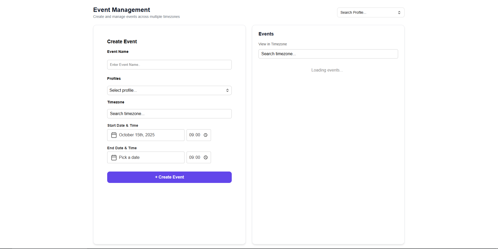

# Event Management Application

An Event Management System where admins can create profiles and manage events across multiple users and timezones. Users can view, create, and update events while respecting their selected timezone.

---

## Table of contents

- [Overview](#overview)
- [Features](#features)
- [Tech stack](#tech-stack)
- [Project structure](#project-structure)
- [Getting started](#getting-started)
- [Environment configuration](#environment-configuration)
- [Running the app](#running-the-app)
- [API overview](#api-overview)
- [Screenshot](#screenshot)


---

## Overview

This repository contains a monorepo with separate frontend and backend folders:

- **Frontend**: React (Vite) application that consumes the backend API and provides UI components for creating and managing events.
- **Backend**: Node.js + Express API with controllers, services, models and validation using MongoDB for persistence.

## Features

- Create, read, update events
- List events with cards and detail views
- Assign events to profiles/users
- Timezone-aware event times
- View event logs
- Centralized API layer using Axios

## Tech stack

| Layer    | Technology |
|---------:|-----------:|
| Frontend | React, HTML, JavaScript, CSS |
| Backend  | Node.js, Express |
| Database | MongoDB |

## Project structure

```
.
├── backend/
│   ├── src/
│   │   ├── config/
│   │   ├── controllers/
│   │   ├── middleware/
│   │   ├── models/
│   │   ├── routes/
│   │   ├── services/
│   │   ├── validations/
│   │   └── app.js
│   ├── .env
│   ├── package-lock.json
│   ├── package.json
│   └── server.js
│
├── frontend/
│   ├── node_modules/
│   ├── public/
│   ├── src/
│   │   ├── api/
│   │   │   ├── axios.js
│   │   │   ├── eventApi.js
│   │   │   └── profileApi.js
│   │   ├── assets/
│   │   ├── components/
│   │   │   ├── common/
│   │   │   ├── CreateEvent/
│   │   │   ├── EditEventModal/
│   │   │   ├── EventCard/
│   │   │   ├── EventList/
│   │   │   └── ViewLogsModal/
│   │   ├── constants/
│   │   ├── contexts/
│   │   ├── hooks/
│   │   ├── pages/
│   │   ├── utils/
│   │   ├── App.css
│   │   └── App.jsx  (or App.js)
│   ├── .env
│   ├── .gitignore
│   ├── .eslintrc.config.js
│   ├── index.css
│   ├── index.html
│   ├── main.jsx
│   ├── package-lock.json
│   ├── package.json
│   ├── README.md
│   └── vite.config.js
│
└── .gitignore
└── README.md

## Getting started

Prerequisites:

- Node.js (16+ recommended)
- npm 
- MongoDB (local or hosted)

Clone the repository:

```bash
git clone <YOUR_REPOSITORY_URL>
cd Event-Management-Application
```

Install dependencies:

```bash
cd backend
npm install

cd ../frontend
npm install
```

## Environment configuration

Create `.env` files for both `backend` and `frontend` based on the examples below.

Example `backend/.env`:

```env
PORT=3000
MONGODB_URI=mongodb://localhost:27017/event-management
```

Example `frontend/.env` (Vite expects `VITE_` prefixes):

```env
VITE_API_URL=http://localhost:3000/api
```


## Running the app

Start the backend (in one terminal):

```bash
cd backend
npm run dev   # development with nodemon
# or
npm start     # run once
```

Start the frontend (in another terminal):

```bash
cd frontend
npm run dev
```

Open the frontend (usually `http://localhost:5173`) in your browser and the backend API at `http://localhost:3000/api`.

## API overview

The backend exposes REST endpoints under the `/api/events` and `/api/profiles` prefixes.

Event routes (implemented in `backend/src/routes/eventRoutes.js`):

| Method | Path | Description |
|-------:|------|------------|
| POST | `/api/events` | Create a new event. Expects a JSON body with title, start/end times (UTC), initialTimezone, assignedProfiles, etc. |
| GET | `/api/events` | Retrieve all events. Returns an array of event objects. |
| GET | `/api/events/:id` | Retrieve a single event by id. |
| GET | `/api/events/profile/:profileId/events` | Retrieve events assigned to a specific profile. |
| PUT | `/api/events/:id` | Update an event. Expects a JSON body with fields to update. |
| GET | `/api/events/:id/logs` | Retrieve the event logs for the given event id. |

Profile routes (implemented in `backend/src/routes/profileRoutes.js`):

| Method | Path | Description |
|-------:|------|------------|
| POST | `/api/profiles` | Create a new profile. Expects profile name in the request body. |
| GET | `/api/profiles` | Retrieve all profiles. |
| GET | `/api/profiles/:id` | Retrieve a single profile by id. |
| PUT | `/api/profiles/:id` | Update a profile by id. Expects profile fields in the request body. |

Notes
- Routes are mounted in `backend/src/app.js` as `/api/events` and `/api/profiles`.
- Validation middleware (`backend/src/middleware/validate.js`) is used on routes that require structured bodies or path params (see the route files for exact usage).
- Returned event objects typically include fields such as: `_id`, `title`, `startTimeUTC`, `endTimeUTC`, `initialTimezone`, `assignedProfiles`, `createdAt`, `updatedAt`.

Example curl requests


For Creating event
```bash
curl -X POST http://localhost:3000/api/events 
	-H "Content-Type: application/json" 
	-d '{
		"title": "Team meeting",
		"startTimeUTC": "2025-10-13T00:30:00Z",
		"endTimeUTC": "2025-10-13T01:30:00Z",
		"initialTimezone": "Asia/Kolkata",
		"assignedProfiles": ["profileId1","profileId2"]
	}'
```


For Creating profile
```bash
curl -X POST http://localhost:3000/api/profiles 
	-H "Content-Type: application/json" 
	-d '{
		"name": "user1"
	}'
```


## Screenshot

**Event Mangement UI**




Thank you for reviewing the Event Management Application. This assignment is designed to demonstrate a complete full-stack setup, robust environment configuration, and seamless API usage across both the backend and frontend components.


